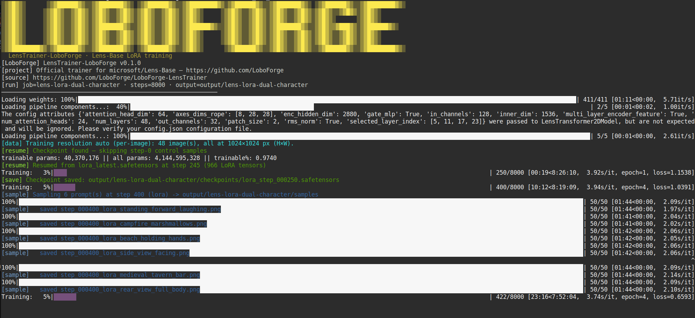

# LensTrainer-LoboForge

Config-driven LoRA trainer for [Microsoft Lens-Base](https://huggingface.co/microsoft/Lens-Base). Train subject/style LoRAs from a folder of images + captions, export ComfyUI-compatible weights, and preview samples during training.



## Quickstart (TL;DR)

**Two scripts only:**

| Script | When |
|--------|------|
| `scripts/bootstrap.sh` | Once per machine — installs everything |
| `scripts/train.sh` | Every run — after you edit `training.env` |

**1. Bootstrap**

```bash
export HF_TOKEN=hf_your_token_here
curl -fsSL https://raw.githubusercontent.com/LoboForge/LoboForge-LensTrainer/main/scripts/bootstrap.sh | bash
```

**2. Configure** — edit `training.env` (created from `training.env.example`):

```bash
cd /workspace/LoboForge-LensTrainer   # or ~/LoboForge-LensTrainer
nano training.env
```

| Variable | Meaning |
|----------|---------|
| `DATASET_PATH` | Folder of images + matching `.txt` captions |
| `LORA_NAME` | Short name for this run (`job.name`) |
| `OUTPUT_DIR` | Checkpoints + `lora_final.safetensors` |
| `STEPS` | Training steps (e.g. `8000`) |
| `TRIGGER_WORD` | Token for `[trigger]` in sample prompts (empty if captions are full sentences) |
| `TRAIN_PRESET` | YAML under `configs/` (sample prompts + LoRA targets) |
| `MODEL_REPO` | `microsoft/Lens-Base` or `./models/Lens-Base` |

**3. Train**

```bash
bash scripts/train.sh
```

Resume: set `RESUME_FROM=latest` and `BASELINE_CONTROL=false` in `training.env`.

Done when you have `OUTPUT_DIR/lora_final.safetensors`. See [Dataset layout](#dataset-layout) and [VRAM](#vram--system-requirements) below.

## Requirements

- Python 3.11+
- **GPU:** NVIDIA CUDA — see [VRAM](#vram--system-requirements)
- **RAM:** 32GB+ system memory recommended (text cache precompute with default settings)
- Hugging Face account with access to gated models (`microsoft/Lens-Base`, GPT-OSS weights)

### VRAM & system requirements

Lens-Base’s DiT is ~**13.4GB** in bf16. This trainer keeps the text encoder and VAE off GPU during training by caching latents and captions to disk — that’s how 16GB cards work at all.

| | Minimum | Recommended |
|---|---------|-------------|
| **GPU VRAM** | **16GB** (RTX 4060 Ti 16GB, 5060 Ti, etc.) | **24GB** (RTX 3090/4090, A5000, …) |
| **System RAM** | **32GB** | **64GB** (faster / safer text precompute) |
| **Preset** | `configs/train_lora_lens_base_24gb.yaml` | same, or `48gb` if you have headroom |

**16GB path (what we test on):** `cpu_offload: true`, disk caches, `gradient_checkpointing: true`, `batch_size: 1`, `disable_mxfp4: true` (text precompute on CPU once). Training holds the full DiT on GPU — there is no smaller mode today without architectural changes.

**Below 16GB VRAM:** not supported for training with Lens-Base using this repo.

**48GB+:** use `configs/train_lora_lens_base_48gb.yaml` — no CPU offload, batch 2, rank 32.

Peak VRAM by phase (16GB preset):

| Phase | On GPU | Rough VRAM |
|-------|--------|------------|
| Training loop | DiT + LoRA only | ~14–16GB |
| Latent precompute | VAE only | ~2–4GB |
| Text precompute (default) | nothing (CPU) | ~0GB |
| Mid-run samples | DiT + VAE swap | ~14–16GB |

## RunPod (fresh GPU pod)

Use the official **RunPod PyTorch** template (CUDA 12.x, Ubuntu). Pick a **24GB+** GPU (e.g. RTX 4090). Mount a **network volume** at `/workspace` so repo, HF cache, and `output/` survive restarts.

In **Jupyter terminal**, **Web terminal**, or **SSH (Direct TCP)**:

```bash
export HF_TOKEN=hf_your_token_here
curl -fsSL https://raw.githubusercontent.com/LoboForge/LoboForge-LensTrainer/main/scripts/bootstrap.sh | bash
```

Upload a dataset with **Direct TCP SSH** (supports SCP), edit `training.env`, then `bash scripts/train.sh`:

```bash
scp -P <PORT> -i ~/.ssh/id_ed25519 -r /path/to/DualCharacterLoras root@<POD_IP>:/workspace/
```

## Setup

Manual install (if you skip `scripts/bootstrap.sh`):

```bash
git clone https://github.com/LoboForge/LoboForge-LensTrainer.git
cd LoboForge-LensTrainer
python -m venv .venv
source .venv/bin/activate   # Windows: .venv\Scripts\activate
pip install -U pip
pip install -r requirements.txt
bash scripts/install_microsoft_lens.sh   # or: source it and run install_microsoft_lens "$PWD"
export PYTHONPATH="$(pwd)/vendor/Lens:${PYTHONPATH}"
```

Clone/update Lens automatically:

```bash
source scripts/install_microsoft_lens.sh
install_microsoft_lens "$(pwd)"
export PYTHONPATH="$(pwd)/vendor/Lens:${PYTHONPATH}"
```

Authenticate with Hugging Face (required for gated checkpoints):

```bash
hf auth login
```

Accept the model license on the Hub for `microsoft/Lens-Base` before first run.

## Dataset layout

Place training pairs in a folder (default `./dataset`). Each image needs a sidecar caption file with the same basename:

```
dataset/
  img001.jpg
  img001.txt
  img002.png
  img002.txt
```

Supported images: `.jpg`, `.jpeg`, `.png`, `.webp`. Caption extension is configurable (`caption_ext`, default `txt`).

Include your trigger token in captions (e.g. `a photo of mytrigger person standing in a park`). Set `sample.trigger_word` in the config to match.

Corrupt or unreadable images are **skipped at startup** (logged to the console and recorded in `cache/manifest.json` under `skipped`). Training continues with valid pairs only.

### Training resolution (no stretching)

| `dataset.resolution` | Behavior |
|----------------------|----------|
| **Positive** (e.g. `1024`) | Every image is resized to a **square** `resolution × resolution` (legacy / uniform datasets). |
| **`0` (auto)** | Each image keeps its **aspect ratio** at native size, snapped to multiples of 16. Mixed sizes work with `train.batch_size: 1`. |

Optional `dataset.max_training_edge` (auto mode only): if the long edge exceeds this value, the image is scaled down before snapping (e.g. `1536` on 16GB VRAM for very large sources).

At startup the trainer logs how many size buckets were found. Preview size follows the dataset when `sample.height` / `sample.width` are **`0`**.

## Sampling during training

Before the first training step, the trainer can render a **step-0 control grid** on the **base model** (no LoRA) using every entry in `sample.prompts`. Files look like:

```
samples/step_000000_control_full_body_front.png
samples/step_000000_control_loboforge_sign.png
```

During training, the same prompt list is rendered again as `step_{NNNNNN}_lora_*.png` so you can compare base vs LoRA side-by-side (same filename suffix).

| Key | Purpose |
|-----|---------|
| `sample.prompts` | Named list — string or `{name, prompt}`; `[trigger]` → `sample.trigger_word` |
| `sample.baseline_control` | Run step-0 control grid before training (default `true`) |
| `train.sample_every` | Sample every N steps after the early phase |
| `train.sample_every_early` | Sample every N steps until `sample_early_until` (set `0` to disable) |
| `train.sample_early_until` | Step cap for the early sample cadence |

On **16GB GPUs**, sampling encodes prompts on **CPU** and swaps **DiT + VAE** onto the GPU one at a time so training does not OOM. Expect ~1–2 minutes per preview image.

**Skip step-0 control** when you already have control PNGs (re-run or resume):

```bash
--set sample.baseline_control=false
```

## Example run

Copy a block below, change paths and names, then run from the repo root with your venv active.

### Dual-character LoRA (DualCharacterLoras)

Preset: `configs/train_lora_dual_character_24gb.yaml` — **8000** steps, **48** image/caption pairs at **1024×1024**, auto resolution (`resolution: 0`), sample prompts copied from your `.txt` captions.

**Requirements before training:**

- Folder of paired files: `item_00104_.png` + `item_00104_.txt` (same basename, extension from `caption_ext`)
- Hugging Face login + `microsoft/Lens-Base` access
- **16GB+ VRAM** with the 24GB preset (`cpu_offload`, caches, `batch_size: 1`)
- Local Lens weights optional: `--set model.repo_id=./models/Lens-Base`

**First run** (builds `cache/`, step-0 control grid, trains 8000 steps):

```bash
cd /media/wrath/AI/LensTrainer-LoboForge
source .venv/bin/activate   # or your ComfyUI venv with requirements installed
export PYTHONPATH="/media/wrath/AI/LensTrainer-LoboForge/vendor/Lens:${PYTHONPATH}"

python train.py configs/train_lora_dual_character_24gb.yaml \
  --set model.repo_id=./models/Lens-Base
```

**Re-run** (reuse caches, skip step-0 control):

```bash
python train.py configs/train_lora_dual_character_24gb.yaml \
  --set model.repo_id=./models/Lens-Base \
  --set sample.baseline_control=false
```

**Resume** after a checkpoint:

```bash
python train.py configs/train_lora_dual_character_24gb.yaml \
  --set model.repo_id=./models/Lens-Base \
  --set train.resume_from=latest \
  --set sample.baseline_control=false
```

**Useful overrides** (same command, add `--set` flags):

| Goal | Example |
|------|---------|
| Different dataset folder | `--set dataset.folder_path=/path/to/images` |
| Different output dir | `--set job.output_dir=./output/my-run` |
| Fewer/more steps | `--set train.steps=6000` |
| Save checkpoints more often | `--set train.save_every=200` |
| Preview cadence | `--set train.sample_every=300` |
| Force square 1024 (instead of auto) | `--set dataset.resolution=1024` |
| Cap huge images in auto mode | `--set dataset.max_training_edge=1536` |
| Faster text cache on RTX 50xx | `--set model.disable_mxfp4=false` |

Outputs: `./output/lens-lora-dual-character/lora_final.safetensors`, `checkpoints/`, `samples/`, `cache/`, `loss.json`.

This dataset uses **full-sentence captions** (character names + scene). Sample prompts in the YAML mirror those lines; you do not need a single `trigger_word` unless you add one to every caption yourself.

### Character LoRA — Willow (LoboForge mascot)

Preset: `configs/train_lora_willow_24gb.yaml` — 2000 steps, samples every 100, rank 8, trigger `Willow`.

**First run** (builds caches + step-0 control + trains):

```bash
python train.py configs/train_lora_willow_24gb.yaml \
  --set model.repo_id=./models/Lens-Base \
  --set dataset.folder_path=/path/to/willow/images \
  --set job.output_dir=./output/lens-lora-willow
```

**Re-run without re-rendering control** (caches hit, skip step-0):

```bash
python train.py configs/train_lora_willow_24gb.yaml \
  --set model.repo_id=./models/Lens-Base \
  --set job.output_dir=./output/lens-lora-willow \
  --set sample.baseline_control=false
```

### Generic subject/style LoRA

```bash
python train.py configs/train_lora_lens_base_24gb.yaml \
  --set dataset.folder_path=/path/to/your/dataset \
  --set sample.trigger_word=mytrigger
```

Outputs land in `job.output_dir`:

- `checkpoints/lora_step_*.safetensors` — periodic LoRA saves (never auto-deleted)
- `lora_latest.safetensors` — copy of the most recent scheduled save (for `resume_from: latest`)
- `lora_emergency.safetensors` — written on Ctrl+C interrupt
- `lora_final.safetensors` — final weights (ComfyUI key format)
- `samples/` — preview PNGs (`step_000000_control_*` baseline on full prompt list, then `step_*_lora_*` during training)
- `cache/` — optional latent and text-embedding caches (see **Caching** below)
- `loss.json` — per-step training loss
- `config.resolved.json` — resolved config snapshot

## Caching (skip precompute on re-runs)

Before training starts, the trainer can build **disk caches** so the VAE and GPT-OSS text encoder are not needed in the training loop (same idea as [Ostris AI Toolkit](https://github.com/ostris/ai-toolkit)). Both presets enable this by default:

- `dataset.cache_latents: true` — VAE encode each image once → `cache/latents/*.pt`
- `model.cache_text_embeddings: true` — GPT-OSS encode each caption once → `cache/text/*.pt`

### What runs where (first run only)

| Phase | Model | Typical device (24GB preset) | Rough time |
|-------|--------|------------------------------|------------|
| `Precomputing latents` | VAE only | GPU | ~seconds per image |
| `Precomputing text` | HF GPT-OSS text encoder | CPU when `disable_mxfp4: true` | ~8–15 min for ~80 images |

Text precompute on CPU is **not** because latents need CPU — latents already ran on GPU. It is because `disable_mxfp4: true` expands the Hub TE to full bf16 (~40GB in RAM), which does not fit whole on a 16GB GPU. That cost is **one-time per dataset/output folder**. Training then only reads cached tensors and trains the DiT LoRA.

### Re-use disk caches on later runs

Caches live under **`job.output_dir/cache/`**. If you start another run with the **same** `output_dir`, dataset, captions, and **per-image training size** (path + caption + height×width), the trainer **skips** any step that already has a matching `.pt` file and goes straight to training.

```bash
# First run: pays precompute + training
python train.py configs/train_lora_lens_base_24gb.yaml \
  --set dataset.folder_path=/path/to/dataset \
  --set job.output_dir=./output/lens-lora-ballet \
  --set sample.trigger_word=ballet

# Same output_dir — reuses cache/ (still starts training from step 0 unless resume_from is set)
python train.py configs/train_lora_lens_base_24gb.yaml \
  --set dataset.folder_path=/path/to/dataset \
  --set job.output_dir=./output/lens-lora-ballet \
  --set train.steps=3000 \
  --set sample.baseline_control=false
```

Keep the same `job.output_dir` when you want to avoid re-encoding. Copy or symlink the whole output folder to train a new run from existing caches.

### When caches are rebuilt

Cache filenames are hashed from **image path**, **caption text**, and **snapped training height×width**. A file is recomputed only if its entry is missing. You get a new encode if you:

- change a caption or swap an image file
- change `dataset.resolution` or switch auto ↔ square mode (or change `max_training_edge` enough to change snapped sizes)
- point `job.output_dir` at a folder without caches
- delete `cache/latents/` or `cache/text/` (or the whole `cache/` tree)

To force a full refresh:

```bash
rm -rf ./output/lens-lora-ballet/cache
```

### Faster text precompute with MXFP4 (optional)

The 24GB preset defaults to `disable_mxfp4: true`, which dequantizes the Hub text encoder to bf16 and runs **text precompute on CPU** (~8–15 min for ~80 images). On **Blackwell (RTX 50xx)** and other GPUs with MXFP4 support, keep the quantized ~6GB encoder and run text precompute on **GPU** (often much faster):

```bash
pip install 'kernels>=0.12.0,<0.15' 'triton>=3.4.0'

python train.py configs/train_lora_lens_base_24gb.yaml \
  --set dataset.folder_path=/path/to/dataset \
  --set job.output_dir=./output/my-run \
  --set model.disable_mxfp4=false
```

| `disable_mxfp4` | Text encoder size | Text precompute (typical) |
|-----------------|-------------------|---------------------------|
| `true` (default) | ~40GB bf16 in RAM | CPU, slower |
| `false` | ~6GB MXFP4 | GPU layer offload, faster |

Use `disable_mxfp4: true` on Ampere/Ada (RTX 30xx/40xx, A100) where MXFP4 kernels are unavailable. Training behavior is the same either way once caches exist — only the one-time encode path changes.

If you switch `disable_mxfp4` after building caches, delete `cache/text/` (or the whole `cache/` folder) so captions are re-encoded with the new TE mode.

**Note:** `kernels>=0.15` is incompatible with `transformers` 5.9 — pin `kernels>=0.12.0,<0.15` (see Troubleshooting).

## Config reference

| Section | Key | Description |
|---------|-----|-------------|
| **job** | `name`, `output_dir` | Run name and output directory |
| **model** | `repo_id` | Hugging Face id (`microsoft/Lens-Base`) **or** path to a local HF-layout folder (see below) |
| | `dtype` | `bfloat16`, `float16`, or `float32` |
| | `disable_mxfp4` | `true`: dequantize TE to bf16 (CPU text precompute on 16GB). `false`: keep MXFP4 (~6GB, GPU text precompute on Blackwell) — use `--set model.disable_mxfp4=false` |
| | `cpu_offload` | Diffusers CPU offload (`text_encoder→transformer→vae`) |
| | `cache_text_embeddings` | Precompute GPT-OSS multi-layer features to disk |
| **dataset** | `folder_path`, `caption_ext` | Data root; one caption file per image (`image.jpg` + `image.txt`) |
| | `resolution` | Square side length when **> 0**. **`0` = auto** — native aspect, snapped to 16px (use `batch_size: 1` if sizes differ) |
| | `max_training_edge` | Auto mode only: max long edge in px before downscale (`0` = no cap) |
| | `cache_latents` | Precompute VAE latents `[B, H×W, 128]` to disk |
| | `max_sequence_length` | GPT-OSS chat prompt max tokens |
| **lora** | `rank`, `alpha`, `dropout`, `target_modules` | PEFT LoRA on transformer Linear layers |
| **train** | `steps`, `batch_size`, `learning_rate`, `optimizer` | Training schedule (`adamw8bit` or `adamw`) |
| | `gradient_checkpointing`, `gradient_accumulation_steps` | VRAM / effective batch |
| | `timestep_type` | `shift` (logit-normal biased) or `uniform` |
| | `save_every`, `sample_every` | Checkpoint and preview interval (after early phase) |
| | `sample_every_early`, `sample_early_until` | Denser previews early (e.g. every 50 until step 500) |
| | `resume_from` | Resume LoRA weights + step (`path`, `latest`, or `auto`); skips step-0 control |
| **sample** | `prompts` | Named prompt list (`[trigger]` → `trigger_word`); string or `{name, prompt}` |
| | `baseline_control` | Step-0 control grid on base model (same prompt list, `step_000000_control_*`) |
| | `walk_seed` | Increment seed per prompt so samples are not identical |
| | `trigger_word`, `width`, `height`, `steps`, `cfg`, `seed` | Preview generation; `[trigger]` in prompts → `trigger_word`. **`height`/`width` = 0** → dataset dominant size |

### VRAM presets

| File | Target | Notes |
|------|--------|-------|
| `configs/train_lora_lens_base_24gb.yaml` | ~16–24GB | Generic subject/style; 2000 steps template |
| `configs/train_lora_dual_character_24gb.yaml` | ~16–24GB | DualCharacterLoras — 8000 steps, auto resolution, caption-based sample prompts |
| `configs/train_lora_willow_24gb.yaml` | ~16–24GB | LoboForge mascot Willow (long run / custom paths) |
| `configs/train_lora_lens_base_48gb.yaml` | 48GB+ | No offload, batch 2, rank 32 |

### Minimal train command template

```bash
cd /path/to/LensTrainer-LoboForge
source .venv/bin/activate
export PYTHONPATH="/path/to/LensTrainer-LoboForge/vendor/Lens:${PYTHONPATH}"

python train.py configs/train_lora_lens_base_24gb.yaml \
  --set model.repo_id=./models/Lens-Base \
  --set dataset.folder_path=/path/to/your/dataset \
  --set dataset.resolution=0 \
  --set job.output_dir=./output/my-lora \
  --set train.steps=8000 \
  --set train.save_every=250 \
  --set train.sample_every=400 \
  --set sample.trigger_word=your_token \
  --set sample.height=0 \
  --set sample.width=0
```

Put `your_token` in every caption and in `sample.prompts` as `[trigger]` if you use a single activation word. For descriptive captions only, leave `trigger_word` empty and write full prompts (see dual-character preset).

Override any field at runtime:

```bash
python train.py configs/train_lora_lens_base_24gb.yaml --set train.steps=500 --set lora.rank=8
```

## Resume from checkpoint

**v1 resume** loads **LoRA weights + step counter** from a prior checkpoint. The optimizer restarts fresh (no momentum carry-over). Step-0 control is **skipped automatically** when `train.resume_from` is set. Existing `loss.json` entries are **appended**, not overwritten.

### When to use what

| Situation | What to do |
|-----------|------------|
| Same dataset, caches already built, **restart training from scratch** | Same `output_dir`, `sample.baseline_control=false`, no `resume_from` |
| Training **interrupted** (power loss, crash) after a checkpoint was saved | `train.resume_from=latest` (or explicit path), same `output_dir` + LoRA config |
| **Extend** a finished run past the original `train.steps` | Raise `train.steps`, `train.resume_from=latest` |

### Config / CLI

```yaml
train:
  resume_from: latest   # or ./output/.../checkpoints/lora_step_000250.safetensors
```

```bash
--set train.resume_from=latest
--set train.resume_from=./output/lens-lora-willow/checkpoints/lora_step_000250.safetensors
```

`latest` / `auto` picks the highest step among:

- `checkpoints/lora_step_*.safetensors`
- `lora_final.safetensors` (uses `step` from file metadata)

### Full resume example

```bash
python train.py configs/train_lora_willow_24gb.yaml \
  --set model.repo_id=./models/Lens-Base \
  --set job.output_dir=./output/lens-lora-willow \
  --set train.steps=2000 \
  --set train.resume_from=latest
```

Training continues at **checkpoint step + 1** until `train.steps`. Samples and saves follow the normal schedule from there (e.g. next sample at 300 if you resume from 250 with `sample_every: 100`).

### Requirements and limits

- Use the **same** `lora.rank`, `lora.alpha`, and `lora.target_modules` as the original run (warnings are printed on mismatch).
- Checkpoints are **ComfyUI-compatible** `safetensors` — the same files you load in ComfyUI are what training resumes from.
- **Not saved in v1:** optimizer state, RNG state, exact dataloader order.
- `resume_from: latest` / `auto` with **no** checkpoint on disk prints a warning and **starts from step 0** (no crash). Use an explicit path only when you know the file exists.
- On **Ctrl+C**, training saves `lora_emergency.safetensors` (and `loss.json` is flushed every 25 steps). `latest` also picks `lora_latest.safetensors` (updated on each scheduled save).

### What gets skipped on resume

| Step | Fresh run | `resume_from` set |
|------|-----------|-------------------|
| Latent/text cache precompute | Runs if missing | Skipped when cache hits |
| Step-0 control samples | Yes (unless `baseline_control: false`) | **Skipped** |
| LoRA init | Random | **Loaded from checkpoint** |
| Training loop | Step 0 → N | Step **checkpoint** → N |

## Training details

### Upstream code (not a fork of another LoRA trainer)

| Component | Source |
|-----------|--------|
| DiT, VAE, pipeline, `transformer/config.json` | Official [microsoft/Lens](https://github.com/microsoft/Lens) + Hugging Face `microsoft/Lens-Base` |
| Training loop, caches, LoRA export, resume, sampling | **This repo** (LensTrainer-LoboForge) |

We do **not** ship a modified Lens checkpoint or a copied config. The only runtime change to Lens is an optional `forward` hook in `lens_trainer/lens_patches.py` so gradient checkpointing fits on 16GB cards. `LensTransformer2DModel.__init__` is **not** patched, so Diffusers should load every field in `config.json` without “will be ignored” warnings.

If you still see that warning, you are likely on an older commit that wrapped `__init__` — update this repo and re-run.

- **Base model:** `microsoft/Lens-Base` (not RL/Turbo variants)
- **Loss:** Flow-matching MSE with target `noise - latents`
- **Timesteps:** Sampled 0…999, passed to the transformer as `timestep / 1000`
- **Text:** GPT-OSS layers `(5, 11, 17, 23)` with chat template and `txt_offset=97`
- **Latents:** FLUX.2 VAE encode → BN normalize → 2×2 patchify → sequence `[B, H×W, 128]`

Only the DiT transformer is trained; VAE and text encoder stay frozen.

## Terminal colors

Long runs use category-colored log lines and tqdm bars so sampling, training, and saves are easy to scan.

| Category | tqdm / tag | Color |
|----------|------------|--------|
| Training loop | `Training` bar | Magenta |
| Latent cache | `Precomputing latents` | Cyan |
| Text cache | `Precomputing text` | Blue |
| Sampling | `[sample]` | Blue |
| Checkpoints / resume | `[save]`, `[resume]` | Green |
| Dataset | `[data]` | Bright cyan |
| Warnings | `[warn]` | Yellow |
| Interrupt | `[error]` | Red |
| Job header | (banner line) | Bright yellow |

Colors are enabled when stdout is a TTY. Disable with either:

```bash
export NO_COLOR=1              # standard — disables colors in most CLI tools
export LENS_TRAINER_COLOR=0    # trainer-only off switch
```

Piped logs and redirected output stay plain text automatically.

Each run always prints the **LoboForge** wordmark (Unicode block art), project URL, and run metadata (for log attribution). Colors follow the rules above; the banner itself is not optional.

## ComfyUI export

Saved LoRA files remap PEFT keys for ComfyUI Lens workflows:

- `base_model.model.*` → stripped
- optional `transformer.*` → `diffusion_model.*`
- final keys look like `diffusion_model.transformer_blocks.*.lora_A.weight`

Load `lora_final.safetensors` (or a step checkpoint) in your existing ComfyUI Lens workflow alongside the base Lens checkpoint.

## Model weights (Hugging Face layout)

The trainer loads Lens via `LensPipeline.from_pretrained()`, which expects the **standard Hugging Face repo layout**:

```
models/Lens-Base/
  model_index.json
  text_encoder/
  tokenizer/
  transformer/
  vae/
  scheduler/
```

### Option A — download everything from the Hub (default)

Set `model.repo_id: microsoft/Lens-Base` (default). On first run, weights download into the Hugging Face cache.

### Option B — assemble locally, skip large re-downloads

If you already have compatible **single-file** DiT and/or VAE safetensors (e.g. from ComfyUI), use the assemble script to build the HF folder and only download the rest (text encoder, tokenizer, configs):

```bash
# Copy the example and edit paths on your machine
cp configs/assemble_weights.example.yaml configs/assemble_weights.local.yaml

python scripts/assemble_lens_repo.py --config configs/assemble_weights.local.yaml
```

Or pass paths on the CLI:

```bash
python scripts/assemble_lens_repo.py \
  --output ./models/Lens-Base \
  --transformer /path/to/lens_bf16.safetensors \
  --vae /path/to/flux2-vae.safetensors
```

Local files are **key-validated** before use. By default they are **symlinked** into the HF tree (`--copy` to duplicate instead). The **text encoder always comes from the Hub** — ComfyUI-packaged GPT-OSS files use a different format and are not supported.

Train against the assembled folder:

```bash
python train.py configs/train_lora_lens_base_24gb.yaml \
  --set model.repo_id=./models/Lens-Base
```

Check an existing folder:

```bash
python scripts/assemble_lens_repo.py --output ./models/Lens-Base --check
```

## Hugging Face gated access

1. Create/login at https://huggingface.co
2. Request access to `microsoft/Lens-Base` on the model page
3. Run `hf auth login` on the training machine
4. **GPU choice:** `disable_mxfp4: true` on Ampere/Ada (RTX 30xx/40xx, A100). On Blackwell (RTX 50xx), use `--set model.disable_mxfp4=false` for faster text precompute (see **Caching**).

## Troubleshooting

### `Invalid handle. Cannot load symbol cublasLtGetVersion` (core dump)

This usually means the dynamic linker picked up the wrong `libcublasLt` — common when running from **Cursor’s integrated terminal**, which prepends AppImage paths to `LD_LIBRARY_PATH`.

`train.py` now sanitizes that automatically. If you still hit the error:

```bash
unset LD_LIBRARY_PATH
python train.py configs/train_lora_lens_base_24gb.yaml ...
```

Or run training from a normal system terminal (outside Cursor). Plain `python -c "import torch; ..."` can still work while Lens training fails, because the bad path only affects some CUDA ops after the full pipeline loads.

### CUDA OOM during `Precomputing text`

The GPT-OSS text encoder is **~6GB in MXFP4**, but the 24GB preset sets `disable_mxfp4: true`, which **dequantizes it to bf16 (~40GB in system RAM)**. That does not fit on a 16GB GPU as a single model. Latent precompute only uses the VAE; text precompute must run the TE once per image to build disk caches (same idea as Ostris).

With `disable_mxfp4: true`, text precompute runs on **CPU** by default (slow once, then training ignores the TE). On Blackwell (RTX 50xx) you can usually keep MXFP4 and speed up precompute:

```bash
--set model.disable_mxfp4=false
```

Requires `pip install kernels>=0.12.0 triton>=3.4.0`. Training still reads cached embeddings — the TE is not used in the training loop.

**Note:** `kernels>=0.15` is incompatible with `transformers` 5.9 (import crash). Use `kernels>=0.12.0,<0.15`, or uninstall `kernels` if you use `disable_mxfp4: true` (CPU text precompute).

### `ValueError: Either a revision or a version must be specified`

Your ComfyUI venv likely has `kernels` 0.15+ from an MXFP4 install attempt. Fix:

```bash
pip install 'kernels>=0.12.0,<0.15'
# or, if you are not using MXFP4:
pip uninstall -y kernels kernels-data
```

Then re-run `train.py`.

### Corrupt or truncated training images

At dataset scan time each image is fully decoded; bad files are skipped with a console message:

```
Skipping Willow_00039_.png: image file is truncated
Dataset ready: 41 valid pair(s), 1 skipped.
```

See `output/.../cache/manifest.json` → `skipped` for the full list. Fix or replace the file and delete its cache entries (or the whole `cache/` folder) if you add it back later.

## License

**LensTrainer-LoboForge** (this repository’s code) is licensed under the [PolyForm Noncommercial License 1.0.0](LICENSE). You may use, modify, and share it for **noncommercial** purposes at no charge.

**Commercial use** (paid services, resale, bundling in commercial products, etc.) requires a separate license — see [COMMERCIAL.md](COMMERCIAL.md).

Microsoft Lens, GPT-OSS, and other **model weights** are not covered by this license; they remain under their respective terms on Hugging Face and other upstream sources.
