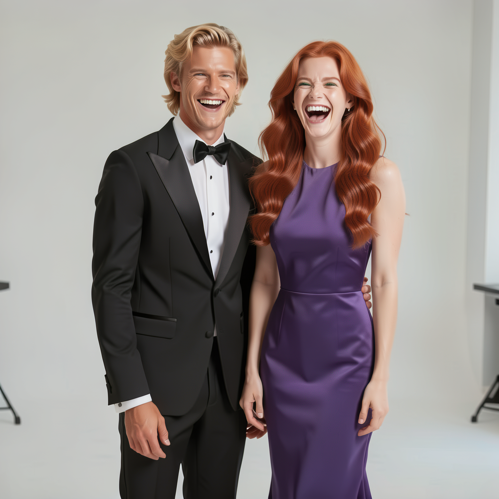
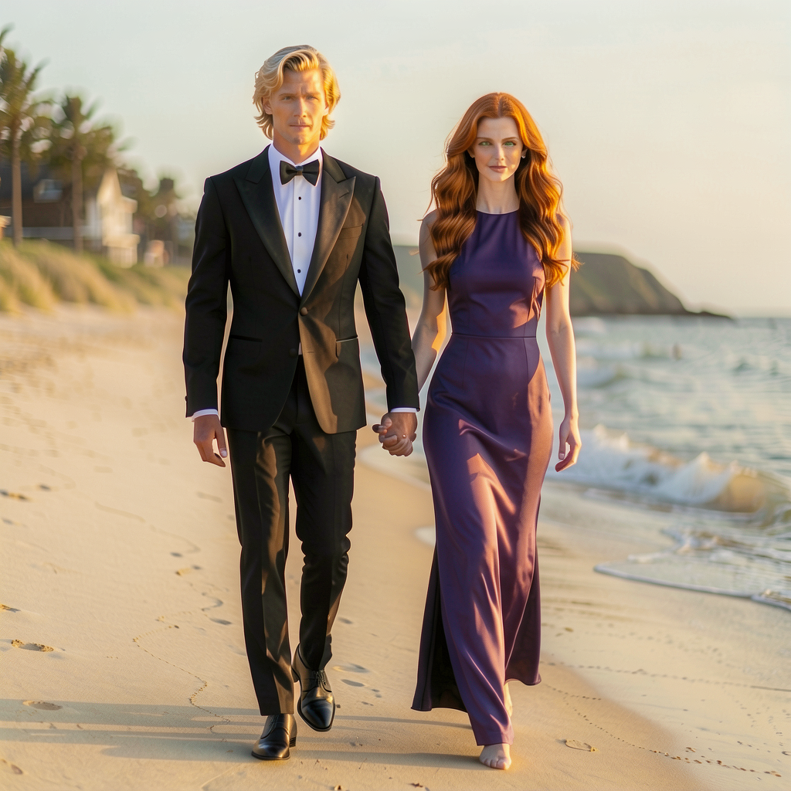

# Sebastian + Jessica — dual-character LoRA (v2)

LoRA fine-tune of **microsoft/Lens-Base** for two recurring characters (Sebastian and Jessica) using [LoboForge-LensTrainer](https://github.com/LoboForge/LoboForge-LensTrainer).

## Download

**Hugging Face:** https://huggingface.co/LoboForge/lens-lora-sebastian-jessica-v2

| File | Local path (not in git) |
|------|------------------------|
| Final weights | `output/lens-lora-sebastian-jessica-v2/lora_final.safetensors` |
| Last checkpoint | `output/lens-lora-sebastian-jessica-v2/checkpoints/lora_step_008000.safetensors` |

Re-publish (from repo root, after `hf auth login`):

```bash
bash scripts/publish_huggingface_lora.sh
```

## Training summary

| Field | Value |
|-------|-------|
| Trainer | LoboForge-LensTrainer v0.1.0 |
| Base | `microsoft/Lens-Base` (local: `./models/Lens-Base`) |
| Dataset | 24 image/caption pairs, 1024×1024, full-sentence captions |
| Preset | `configs/train_lora_dual_character_24gb.yaml` |
| Steps | 8000 |
| LoRA rank / alpha | 16 / 16 |
| Optimizer | AdamW 8-bit |
| VRAM preset | 24GB (CPU offload, TE + latent cache, `disable_mxfp4`) |
| Final step | 8000 |

Resolved config: `output/lens-lora-sebastian-jessica-v2/config.resolved.json`

## Prompt format

Captions are **full sentences** — no single trigger token. Include both character descriptions and the scene, matching training `.txt` files.

Example:

```
Sebastian is a blonde man with long hair and irish blue eyes in a tuxedo. Jessica is a redhead woman with long copper colored red hair and irish green eyes in a purple dress named. They are standing together facing forward and laughing
```

## Inference (Lens-Base)

| Setting | Value |
|---------|-------|
| Steps | 50 |
| CFG | 5.0 |
| Resolution | 1024×1024 (or native training size) |

ComfyUI: load **Lens-Base** checkpoint + this LoRA (`diffusion_model.*` keys, exported by the trainer).

## Samples





*Mid-training previews from step 8000 (`samples/step_008000_lora_*.png`).*

## Reproduce

```bash
cd /path/to/LoboForge-LensTrainer
export PYTHONPATH="$(pwd)/vendor/Lens:${PYTHONPATH}"

python train.py configs/train_lora_dual_character_24gb.yaml \
  --dataset-path /path/to/DualCharacterLoraV2 \
  --output-dir ./output/lens-lora-sebastian-jessica-v2 \
  --job-name lens-lora-sebastian-jessica-v2 \
  --model-repo ./models/Lens-Base \
  --steps 8000 --save-every 250 --sample-every 400 \
  --resolution 0 --disable-mxfp4 --no-baseline-control
```

## License

Trainer code: PolyForm Noncommercial 1.0.0. Lens-Base weights: Microsoft / Hugging Face license. LoRA weights: PolyForm Noncommercial 1.0.0 (see Hugging Face model card).
